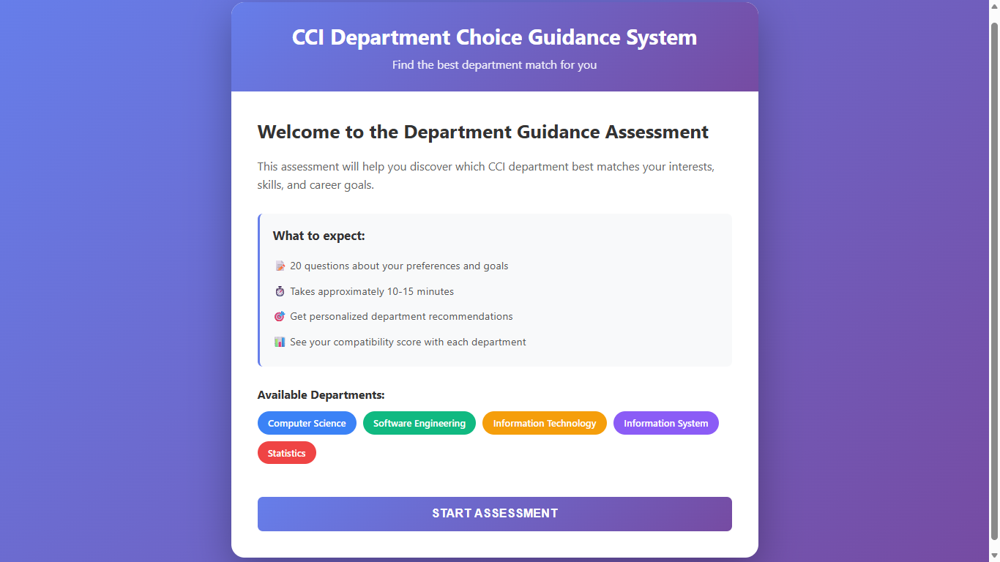

# CCI Department Choice Guidance System

[](https://github.com/asladdiin92/cci-department-guidance)
[](https://github.com/asladdiin92/cci-department-guidance)
[](LICENSE)

> An intelligent web-based guidance system to help CCI students at Haramaya University choose the right department based on their interests, skills, and career goals.

---

## 📋 Table of Contents

- [About](#about)
- [Problem Statement](#problem-statement)
- [Features](#features)
- [Technology Stack](#technology-stack)
- [Project Structure](#project-structure)
- [Getting Started](#getting-started)
- [Development Team](#development-team)
- [Documentation](#documentation)
- [Contributing](#contributing)
- [License](#license)

---

## 🎯 About

The **CCI Department Choice Guidance System** is a full-stack web application developed as part of an industrial practice project at Haramaya University's ICT Center. The system helps students make informed decisions when selecting their department after completing the freshman course.

**Available Departments:**
- Computer Science (CS)
- Software Engineering (SWE)
- Information Technology (IT)
- Information System (IS)
- Information Science (ISC)
- Statistics (STAT)

---

## 🔍 Problem Statement

Students at the College of Computing and Informatics (CCI) often face challenges when choosing their department:

- **Lack of structured guidance** for department selection
- **Limited understanding** of differences between departments (CS/SWE/IT/IS/ISC/Statistics)
- **Peer-based decisions** rather than interest/skill-based choices
- **High department transfer rates** indicating poor initial choices
- **Confusion about career paths** and skill requirements

**Survey Data (43 responses):**
- Only **21.8%** of students felt fully confident about understanding department differences before choosing
- **61%** currently in Computer Science
- **19.5%** in Software Engineering
- **19.5%** in Information Technology

---

## ✨ Features

### For Students
- 📝 **Interactive Assessment** - 20 carefully designed questions (10-15 minutes)
- 🎯 **Personalized Recommendations** - Top 3 department matches with scores (0-100%)
- 📊 **Department Comparison** - Side-by-side comparison of departments
- 📚 **Department Information** - Detailed profiles for each department
- 💼 **Career Insights** - Job roles and market demand in Ethiopia
- 📱 **Mobile-Friendly** - Responsive design for all devices
- 🌐 **Multi-Language Support** - English and Amharic (planned)

### For Administrators
- ⚙️ **Content Management** - Update department information
- 📈 **Analytics Dashboard** - View usage statistics and trends
- 📝 **Question Management** - Add/modify assessment questions
- 🔍 **Data Insights** - Analyze student preferences and recommendations

---

## 🛠️ Technology Stack

This repository is an Electron-based desktop application that uses plain HTML, CSS, and vanilla JavaScript for its user interface. It does not include a separate backend API in this distribution — the app is a client-side/static Electron app.

### Core
- **Electron** - Desktop application shell (main runtime)
- **HTML / CSS / JavaScript** - UI and application logic
- **Chart.js** (optional) - Data visualization (used in dashboard)

### Development Tools
- **Node.js / npm** - Dependency management and scripts
- **Git** - Version control
- **VS Code** - Recommended editor

### Packaging / Deployment (optional)
- **electron-builder** or **electron-forge** - Packaging the app for Windows/macOS/Linux
- **Docker** (optional) - For any auxiliary services if added later

---

## 📁 Project Structure

This project is structured as an Electron desktop application with static frontend resources. Key files and folders:

```
department-choice-system/
├── index.html               # App entry (renderer)
├── package.json             # npm scripts and Electron main
├── src/
│   ├── main/                # Electron main process
│   │   └── main.js
│   ├── js/                  # Renderer JavaScript
│   │   ├── app.js
│   │   └── dashboard.js
│   ├── css/                 # Styles
│   │   └── styles.css
│   ├── data/                # Questions and department data (JS files)
│   └── renderer/            # (optional renderer subfolders)
├── assets/                  # Images and icons
├── public/                  # Static HTML builds (dashboard, etc.)
├── docs/                    # Project documentation
└── README.md
```

Notes:
- There is no separate backend API or database in this repository by default. If a server is added later, place it under a top-level `server/` folder.

```
cci-department-guidance/
├── src/
│   ├── components/          # React components
│   │   ├── Welcome.jsx
│   │   ├── Assessment/
│   │   ├── Results/
│   │   ├── Comparison/
│   │   └── DepartmentInfo/
│   ├── data/
│   │   ├── questions.js     # Assessment questions
│   │   └── departments.js   # Department data
│   ├── utils/
│   │   └── scoring.js       # Scoring algorithm
│   └── App.jsx
├── public/
│   ├── index.html
│   └── assets/
├── server/
│   ├── routes/
│   ├── controllers/
│   ├── models/
│   └── server.js
├── docs/
│   ├── SYSTEM-DESIGN-ANALYSIS.md
│   ├── UI-MOCKUPS.md
│   ├── TEAM-SHARE.md
│   ├── LINUX-TOOLS-GUIDE.md
│   └── GITHUB-PUSH-GUIDE.md
├── .gitignore
├── package.json
└── README.md
```

---

## 🚀 Getting Started

### Prerequisites

- **Node.js** (v16 or higher)
- **npm** (bundled with Node)
- **Git**

> This repository is an Electron desktop app. There is no bundled backend service or database required to run the UI in this repository.

### Install & Run (Development)

1. Clone the repository
```
git clone https://github.com/asladdiin92/cci-department-guidance.git
cd department-choice-system
```

2. Install dependencies
```
npm install
```

3. Start the app (opens the Electron window)
```
npm start
```

Notes:
- The main application entry is `index.html` and the Electron main process is `src/main/main.js`.
- A small admin dashboard is available at `public/dashboard.html` and can be opened directly in a browser for preview.

### Packaging (optional)

To create distributable installers, add a packaging tool such as `electron-builder` or `electron-forge` and follow their documentation.

---

## 👥 Development Team

**Haramaya University ICT Center - Industrial Practice 2026**

| Name | Role | GitHub | Focus Area |
|------|------|--------|------------|
| Asladin Abdukedir | Frontend Developer & Lead | [@asladdiin92](https://github.com/asladdiin92) | Assessment System |
| Arafat Bule | Backend Developer | TBA | API & Database |
| Burqa Jemal | UI/UX Designer | TBA | Interface Design |
| Usman Abdi | Full Stack | TBA | Integration |
| Asledin Abdul-Qadir | Project Coordinator | TBA | Team Coordination |

**Supervisor:** [ICT Center Supervisor Name]  
**Academic Advisor:** [Advisor Name]

---

## 📚 Documentation

Comprehensive documentation is available in the `/docs` folder:

- **[System Design Analysis](docs/SYSTEM-DESIGN-ANALYSIS.md)** - Complete system architecture
- **[UI Mockups](docs/UI-MOCKUPS.md)** - Visual designs and layouts
- **[Team Share](docs/TEAM-SHARE.md)** - Component breakdown and planning
- **[Linux Tools Guide](docs/LINUX-TOOLS-GUIDE.md)** - Development environment setup
- **[GitHub Guide](docs/GITHUB-PUSH-GUIDE.md)** - Git workflow and collaboration

---

## 🎓 Project Timeline

| Phase | Duration | Status |
|-------|----------|--------|
| **Requirement Gathering** | Weeks 1-2 | ✅ Complete |
| **System Design** | Weeks 3-4 | 🔄 In Progress |
| **Implementation** | Weeks 5-10 | ⏳ Pending |
| **Testing** | Weeks 11-12 | ⏳ Pending |
| **Deployment** | Weeks 13-14 | ⏳ Pending |

---

## 🔑 Key Features Implementation Status

- [x] Project initialization and setup
- [x] System design and architecture
- [x] UI mockups and wireframes
- [x] Question strategy (20 questions)
- [ ] React frontend implementation
- [ ] Tailwind CSS styling
- [ ] Assessment flow
- [ ] Scoring algorithm
- [ ] Results display
- [ ] Department comparison
- [ ] Backend API
- [ ] Database schema
- [ ] Admin panel
- [ ] Authentication
- [ ] Deployment

---

## 🤝 Contributing

This is an academic project for industrial practice at Haramaya University. Contributions from team members are welcome!

### For Team Members:

1. Create your feature branch
```bash
git checkout -b yourname-feature
```

2. Make your changes and commit
```bash
git add .
git commit -m "Add: description of your changes"
```

3. Push to your branch
```bash
git push origin yourname-feature
```

4. Create a Pull Request on GitHub

### Commit Message Convention:
- `Add:` for new features
- `Fix:` for bug fixes
- `Update:` for changes to existing features
- `Docs:` for documentation updates
- `Style:` for formatting changes
- `Refactor:` for code refactoring

---

## 📊 Project Metrics

- **Total Lines of Code:** 3,773+ (initial documentation)
- **Documentation Pages:** 5 comprehensive guides
- **Questions Designed:** 20 assessment questions
- **Departments Covered:** 5 CCI departments
- **Target Users:** 400+ CCI students per year
- **Expected Impact:** 50% reduction in department transfers

---

## 🎯 Project Goals

1. ✅ **Informed Decision Making** - Help students choose based on data
2. ✅ **Reduced Transfers** - Minimize department changes after selection
3. ✅ **Better Fit** - Match students with compatible departments
4. ✅ **Career Clarity** - Provide clear job market information
5. ✅ **Scalability** - Expandable to other colleges/universities

---

## 📞 Contact

**Project Repository:** [github.com/asladdiin92/cci-department-guidance](https://github.com/asladdiin92/cci-department-guidance)

**Organization:** Haramaya University - ICT Center  
**Location:** Haramaya, Ethiopia  
**Project Duration:** August 2026 - November 2026

For questions or feedback:
- Create an issue on GitHub
- Contact the development team
- Reach out to ICT Center supervisors

---

## 📄 License

This project is licensed under the MIT License - see the [LICENSE](LICENSE) file for details.

---

## 🙏 Acknowledgments

- **Haramaya University ICT Center** for hosting the internship
- **CCI Department Heads** for providing valuable insights
- **Survey Respondents** for sharing their experiences
- **Project Advisor** for guidance and support
- **Fellow Interns** for collaboration and teamwork

---

## 📸 Screenshots

### Welcome Screen


### Development Progress
More screenshots will be added as features are completed:

- **Assessment Interface** - In development 🔨
- **Results Display** - In development 🔨
- **Department Comparison** - In development 🔨
- **Mobile View** - In development 🔨
- **Admin Dashboard** - Planned 📋


---

## 🔗 Related Links

- [Haramaya University](https://www.haramaya.edu.et)
- [College of Computing and Informatics](https://www.haramaya.edu.et/cci)
- [Project Documentation](docs/)
- [Issue Tracker](https://github.com/asladdiin92/cci-department-guidance/issues)

---

## 📈 Future Enhancements

- [ ] Mobile app (React Native)
- [ ] AI-powered recommendations
- [ ] Alumni success tracking
- [ ] Integration with university portal
- [ ] Chatbot for instant questions
- [ ] Email notifications
- [ ] PDF report generation
- [ ] Multi-university support

---

<p align="center">
  <strong>Built with ❤️ by Haramaya University ICT Center Interns</strong>
</p>

<p align="center">
  <sub>August 2026 - Industrial Practice Project</sub>
</p>
